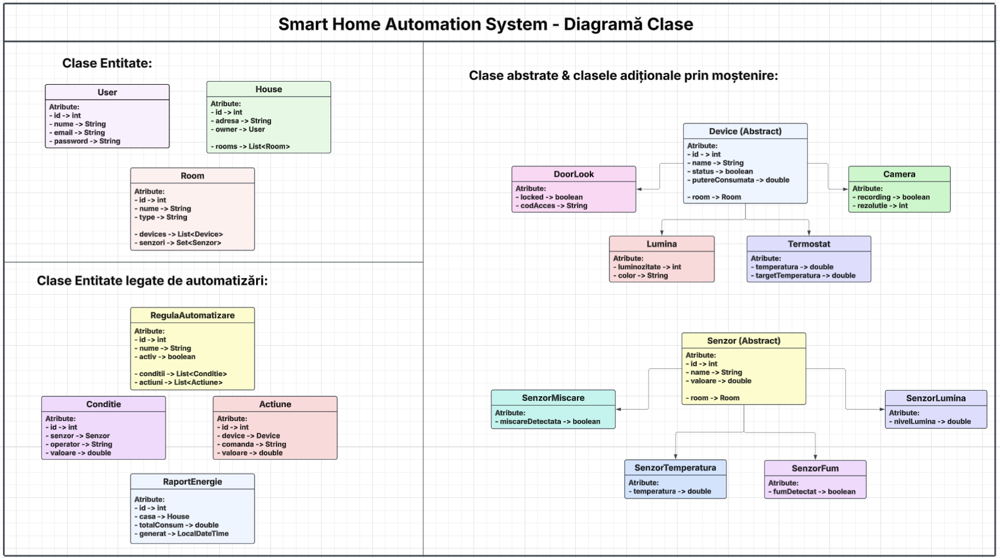
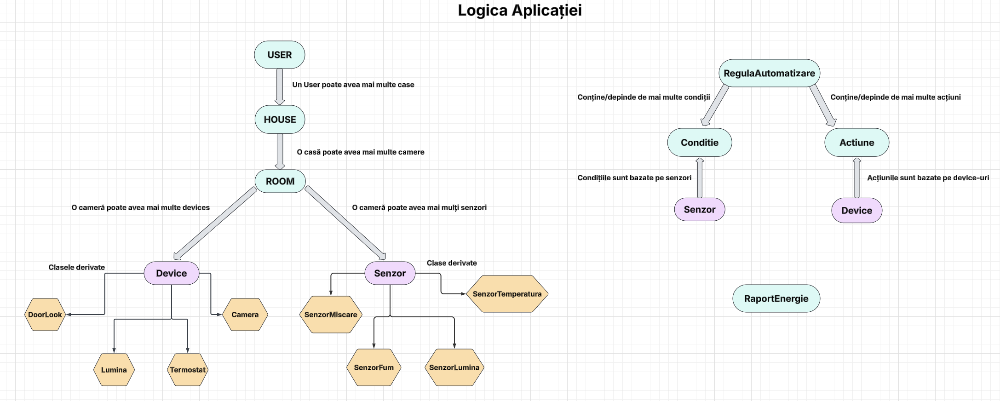
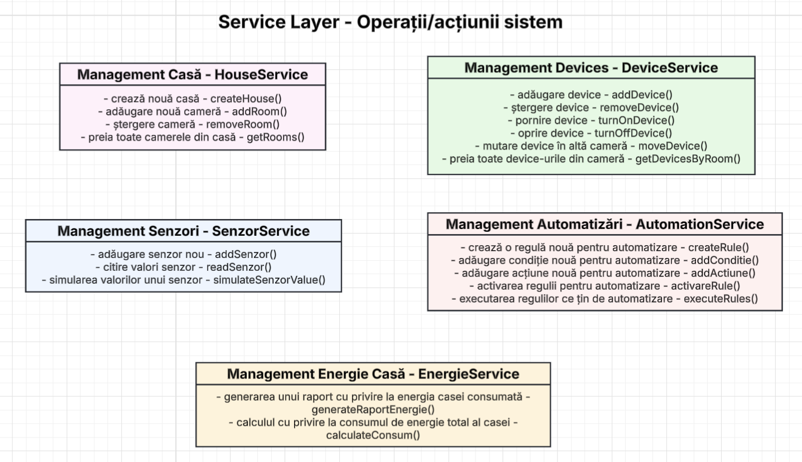

# 🏠 Smart Home Automation System

Sistem de automatizare a unei case inteligente, dezvoltat în **Java**, ca proiect pentru disciplina **Programare Avansată pe Obiecte - Java**.

Aplicația permite gestionarea dispozitivelor, senzorilor și regulilor de automatizare dintr-o locuință inteligentă, oferind funcționalități de monitorizare a consumului energetic și execuție automată a acțiunilor pe baza condițiilor din mediu.

---

## Funcționalități principale

### Management Casă
- Creare casă nouă și asociere cu un utilizator
- Adăugare / ștergere camere
- Vizualizare camere dintr-o casă

### Management Dispozitive
- Adăugare / ștergere dispozitive într-o cameră
- Pornire / oprire dispozitive
- Mutare dispozitiv între camere
- Listare dispozitive per cameră

### Management Senzori
- Adăugare senzori într-o cameră
- Citire valori senzori
- Simulare valori (pentru testare)

### Automatizări
- Creare reguli de automatizare
- Definire condiții (bazate pe senzori) și acțiuni (bazate pe dispozitive)
- Activare / dezactivare reguli
- Execuție automată: dacă toate condițiile sunt îndeplinite, acțiunile se declanșează

### Rapoarte Energie
- Calcul consum energetic total al casei
- Generare raport cu timestamp

---

## Structura proiectului

```
src/
├── model/
│   ├── User.java
│   ├── House.java
│   ├── Room.java
│   ├── RaportEnergie.java
│   ├── device/
│   │   ├── Device.java              (abstract)
│   │   ├── DoorLock.java
│   │   ├── Camera.java
│   │   ├── Lumina.java
│   │   └── Termostat.java
│   ├── senzor/
│   │   ├── Senzor.java              (abstract)
│   │   ├── SenzorMiscare.java
│   │   ├── SenzorTemperatura.java
│   │   ├── SenzorFum.java
│   │   └── SenzorLumina.java
│   └── automatizare/
│       ├── RegulaAutomatizare.java
│       ├── Conditie.java
│       └── Actiune.java
├── service/
│   ├── HouseService.java
│   ├── DeviceService.java
│   ├── SenzorService.java
│   ├── AutomationService.java
│   └── EnergieService.java
└── Main.java
```

---

## Diagrame

### Diagrama de clase
Prezintă toate entitățile sistemului, atributele fiecărei clase, relațiile de moștenire și asocierile dintre obiecte.



### Logica aplicației
Ilustrează relațiile dintre entități: un User deține mai multe House-uri, o House conține Room-uri, iar fiecare Room poate avea Device-uri și Senzori. Regulile de automatizare leagă Condiții (bazate pe Senzori) de Acțiuni (bazate pe Device-uri).



### Operații sistem (Service Layer)
Prezintă cele 5 servicii ale aplicației și metodele expuse de fiecare.



---

## Cerințe tehnice acoperite

| Cerință | Implementare |
|---|---|
| Minim 8 tipuri de obiecte | 17 clase model (User, House, Room, 4 Device-uri, 4 Senzori, RegulaAutomatizare, Conditie, Actiune, RaportEnergie) |
| Minim 10 acțiuni/interogări | 20+ operații distribuite în 5 servicii |
| Clase cu atribute private + metode acces | Toate clasele folosesc encapsulare cu getteri/setteri |
| Minim 2 colecții diferite | `List<Device>` și `Set<Senzor>` în Room, `List<Room>` în House |
| Minim 1 colecție sortată | Dispozitivele pot fi sortate după consum energetic |
| Moștenire | Device → DoorLock, Camera, Lumina, Termostat; Senzor → SenzorMiscare, SenzorTemperatura, SenzorFum, SenzorLumina |
| Clasă serviciu | 5 clase de serviciu care expun operațiile sistemului |
| Clasă Main | Punct de intrare cu demonstrarea tuturor funcționalităților |

---

## 📅 Etape dezvoltare

- [x] **Etapa I** — Definirea sistemului și implementarea in-memory
- [ ] **Etapa II** — Persistență cu bază de date relațională (JDBC) + serviciu de audit CSV

---

## Tehnologii

- **Java 21**
- **JDBC + SQLite/PostgreSQL** *(Etapa II)*
