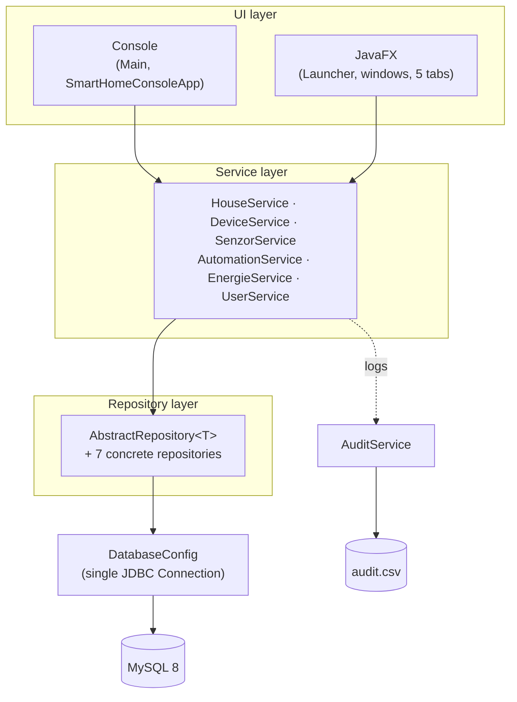
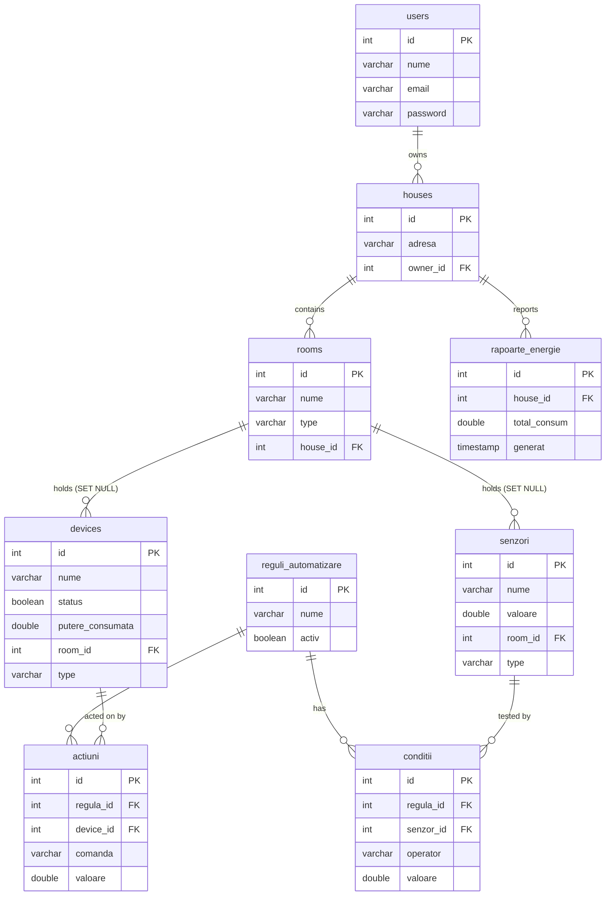

# Smart Home Automation System

A desktop smart-home management application in Java 17: manage houses, rooms, devices
and sensors, define IF-THEN automation rules, and track energy consumption — persisted
in MySQL through plain JDBC, with both a console interface and a JavaFX GUI.


**Jump to:** [Features](#features) · [Tech stack](#tech-stack) · [Architecture](#architecture) ·
[Domain model](#domain-model) · [Key concepts & design decisions](#key-concepts--design-decisions) ·
[Database schema](#database-schema) · [Getting started](#getting-started) ·
[Project structure](#project-structure) · [Known limitations](#known-limitations--possible-improvements)

---

## Screenshots

<!-- TODO: add docs/screenshots/login.png        — JavaFX login screen -->
<!-- TODO: add docs/screenshots/devices-tab.png   — Devices tab with cascade house -> room filtering -->
<!-- TODO: add docs/screenshots/automation-tab.png — Automation tab showing rules, conditions and actions -->

> Screenshots require a running MySQL instance and a display, so they are not committed yet.
> See [Getting started](#getting-started) to run the app, then drop the images into `docs/screenshots/`.

---

## Features

- Manage **houses** and the **rooms** inside them, scoped to the logged-in user.
- Control **4 device types** — lights, thermostats, security cameras, smart door locks
  (turn on/off, move between rooms, adjust type-specific settings).
- Simulate **4 sensor types** — temperature, motion, smoke and ambient light, with manual
  or randomly generated readings.
- Define **IF-THEN automation rules**: a set of sensor conditions (AND logic) that trigger
  a set of device actions.
- Compute **energy consumption** per house and generate timestamped energy reports.
- Append-only **audit trail** of every state-changing operation to a CSV file.
- **3 run modes:** an automated demo, an interactive console menu, and a JavaFX desktop GUI.

---

## Tech stack

| Layer           | Technology                                   | Notes                                                        |
| --------------- | -------------------------------------------- | ------------------------------------------------------------ |
| Language        | Java 17                                      | Uses records-era features such as `switch` expressions and pattern matching |
| Build           | Maven                                        | Non-standard `sourceDirectory=src`; `.sql`/`.properties` bundled as resources |
| Database        | MySQL 8                                       | 9-table relational schema with foreign keys and `ON DELETE CASCADE` |
| Data access     | JDBC (`mysql-connector-j` 8.4.0), no ORM     | `PreparedStatement` throughout; single shared `Connection`   |
| GUI             | JavaFX 21.0.4 (controls, graphics, base)     | `javafx-maven-plugin`; `TableView` + property binding        |
| Audit           | Plain CSV (`java.nio`)                        | Append-only log, one line per state-changing operation       |

---

## Architecture

The code is organised in layers, with dependencies pointing downward only. The UI (console
or JavaFX) calls **services**, which hold business rules and in-memory domain state; services
call **repositories**, which translate between objects and SQL rows; repositories obtain their
JDBC `Connection` from a single `DatabaseConfig`. The `AuditService` sits to the side and is
invoked by services on every state-changing operation.


```mermaid
flowchart TD
    subgraph UI["UI layer"]
        Console["Console<br/>(Main, SmartHomeConsoleApp)"]
        FX["JavaFX<br/>(Launcher, windows, 5 tabs)"]
    end
    subgraph SVC["Service layer"]
        Services["HouseService · DeviceService · SenzorService<br/>AutomationService · EnergieService · UserService"]
    end
    subgraph REPO["Repository layer"]
        Repos["AbstractRepository&lt;T&gt;<br/>+ 7 concrete repositories"]
    end
    DB["DatabaseConfig<br/>(single JDBC Connection)"]
    MySQL[("MySQL 8")]
    Audit["AuditService"]
    CSV[("audit.csv")]

    Console --> Services
    FX --> Services
    Services --> Repos
    Services -. logs .-> Audit
    Repos --> DB
    DB --> MySQL
    Audit --> CSV
```

The repository responsibilities are illustrated further in the existing design diagrams:

- [Class diagram](docs/diagrama_clase.png) — all entities, attributes and inheritance relationships
- [Application logic](docs/logica_clase.png) — how `User`, `House`, `Room`, devices, sensors and rules relate
- [System operations](docs/operatii_sistem.png) — the service layer and the operations it exposes

---

## Domain model

```
User ──owns──> House ──contains──> Room ──contains──> Device (abstract)
                                        └──contains──> Senzor (abstract)

Device (abstract)                 Senzor (abstract)
├── Lumina        (light)         ├── SenzorTemperatura  (temperature)
├── Termostat     (thermostat)    ├── SenzorMiscare      (motion)
├── Camera        (security cam)  ├── SenzorFum          (smoke)
└── DoorLock      (smart lock)    └── SenzorLumina       (ambient light)

RegulaAutomatizare (automation rule) = List<Conditie> (on sensors) + List<Actiune> (on devices)
RaportEnergie (energy report)        = per-house consumption snapshot with a timestamp
```

The codebase uses Romanian identifiers. Glossary for readers:

| Code (Romanian)       | English            | Code (Romanian) | English       |
| --------------------- | ------------------ | --------------- | ------------- |
| `Casa` / `House`      | House              | `Senzor`        | Sensor        |
| `Camera` (Room `type`)| Room / camera*     | `Miscare`       | Motion        |
| `Lumina`              | Light              | `Fum`           | Smoke         |
| `Termostat`           | Thermostat         | `RegulaAutomatizare` | Automation rule |
| `DoorLock`            | Smart lock         | `Conditie`      | Condition     |
| `Consum`              | Consumption        | `Actiune`       | Action        |
| `Putere`              | Power              | `RaportEnergie` | Energy report |

\* `Camera` is also the name of the security-camera device class — context disambiguates it
from a room. Code identifiers are kept as-is; this table is only a reading aid.

---

## Key concepts & design decisions

Each point notes **what**, **where in the code**, and **why**.

**Object-oriented design**
- *Abstraction & inheritance* — `Device` and `Senzor` are abstract bases with four concrete
  subclasses each (`model/device`, `model/senzor`). A generic device/sensor cannot be
  instantiated; each real type carries its own attributes.
- *Polymorphism* — `DeviceRepository.mapRow()` reads the `type` discriminator column and
  instantiates the correct subclass via a `switch` expression, so a single query over the
  `devices` table rebuilds a heterogeneous list.
- *Encapsulation* — fields are private/protected with accessors; `Room.getDevices()` /
  `getSenzori()` return unmodifiable views to protect the internal collections.
- *`Comparable`* — `Device implements Comparable<Device>`, ordering by power consumption
  (tie-broken by id), used by `DeviceService.getDevicesSortedByConsum()`.

**Generics**
- `AbstractRepository<T>` (`repository/AbstractRepository.java`) implements `findById`
  (returns `Optional<T>`), `findAll`, `deleteById` and `deleteAll` once for every entity.

**Design patterns**
- *Template Method* — `AbstractRepository<T>` defines the CRUD skeleton; subclasses supply
  `getTableName()`, `mapRow()`, `save()` and `update()`.
- *Repository* — one repository per aggregate isolates persistence from the services.
- *Singleton* — `DatabaseConfig`, `AuditService`, every repository and `AppContext` use a
  thread-safe `synchronized getInstance()`. Rationale: a single shared JDBC connection and a
  single CSV writer avoid conflicting instances and interleaved writes. (Trade-off: this is
  global state — see [Known limitations](#known-limitations--possible-improvements).)
- *Service locator* — `AppContext` (JavaFX) holds the shared service instances and current
  user/house; windows and tabs pull services from it. There is no dependency injection.

**Persistence**
- *JDBC without an ORM* — chosen deliberately to work directly with connections,
  `PreparedStatement`s and `ResultSet`s rather than hiding them behind JPA/Hibernate.
- *`PreparedStatement` everywhere* — parameters are bound separately from the SQL text,
  preventing SQL injection.
- *Single-Table Inheritance* — each hierarchy (`Device`, `Senzor`) maps to one table with a
  `type` discriminator and nullable subtype columns. Trade-off: no joins to reconstruct an
  object, at the cost of nullable columns that don't apply to every subtype.
- *Referential integrity* — foreign keys with `ON DELETE CASCADE` (deleting a house removes
  its rooms, devices, sensors and reports); device/sensor `room_id` uses `ON DELETE SET NULL`.

**Collections**
- `List<Room>` / `List<Device>` — insertion order is meaningful.
- `Set<Senzor>` (`HashSet`) — a sensor can't appear twice in a room; order is irrelevant.
- `TreeMap<Integer, RegulaAutomatizare>` (`AutomationService`) — keeps rules sorted by id so
  `executeRules()` always evaluates them in a consistent order without an explicit sort.

**Error handling**
- An unchecked hierarchy: `AppException extends RuntimeException`, with `ValidationException`,
  `DuplicateEntityException` and `NotFoundException`. Validation errors are internal
  invariants, so callers aren't forced into `try/catch`; the UI still catches specific types
  to show tailored messages.

**Automation engine** (`AutomationService.executeRules()`)
- Iterates active rules in id order. For each rule it evaluates **all** conditions (AND logic)
  using the operators `>`, `<`, `>=`, `<=`, `==`; if all hold, it runs the rule's actions.
- Supported actions: `turnOn`, `turnOff`, `setTemperature` (thermostats), `setLuminozitate`
  (lights), `lock` / `unlock` (door locks). Commands are validated against the device type,
  and executed changes are persisted to the database.

**Audit trail** (`AuditService`)
- Appends `action,timestamp` (ISO-8601) to `audit.csv` with `StandardOpenOption.APPEND`;
  the file is created with a header on first use and never overwritten.

**JavaFX GUI**
- `Launcher` (a non-`Application` class) calls `Application.launch` to start the FX thread.
  Navigation: `LoginWindow` → `RegisterWindow` (a `WINDOW_MODAL` dialog) → `MainWindow`.
- `MainWindow` is a `BorderPane` with a 5-tab `TabPane` (Houses & Rooms, Devices, Sensors,
  Automation, Energy); switching tabs calls `refresh()` on the activated tab.
- Tables use `TableView` + `ObservableList` with JavaFX property cell-value factories.
- The Devices tab filters in cascade (house → room → devices) and its add-dialog shows
  type-specific fields depending on the selected device type.

---

## Database schema

Defined in [`src/schema.sql`](src/schema.sql) — 9 tables. Run it once against an empty
`smart_house_db` database (it is **not** created automatically at startup). Primary keys are
plain `INT` values assigned by the application (`nextId()` = `MAX(id)+1`), not `AUTO_INCREMENT`.


```mermaid
erDiagram
    users ||--o{ houses : owns
    houses ||--o{ rooms : contains
    rooms ||--o{ devices : "holds (SET NULL)"
    rooms ||--o{ senzori : "holds (SET NULL)"
    houses ||--o{ rapoarte_energie : reports
    reguli_automatizare ||--o{ conditii : has
    reguli_automatizare ||--o{ actiuni : has
    senzori ||--o{ conditii : "tested by"
    devices ||--o{ actiuni : "acted on by"

    users {
        int id PK
        varchar nume
        varchar email
        varchar password
    }
    houses {
        int id PK
        varchar adresa
        int owner_id FK
    }
    rooms {
        int id PK
        varchar nume
        varchar type
        int house_id FK
    }
    devices {
        int id PK
        varchar nume
        boolean status
        double putere_consumata
        int room_id FK
        varchar type
    }
    senzori {
        int id PK
        varchar nume
        double valoare
        int room_id FK
        varchar type
    }
    rapoarte_energie {
        int id PK
        int house_id FK
        double total_consum
        timestamp generat
    }
    reguli_automatizare {
        int id PK
        varchar nume
        boolean activ
    }
    conditii {
        int id PK
        int regula_id FK
        int senzor_id FK
        varchar operator
        double valoare
    }
    actiuni {
        int id PK
        int regula_id FK
        int device_id FK
        varchar comanda
        double valoare
    }
```

---

## Getting started

### Prerequisites

- JDK 17+
- Maven 3.8+
- MySQL 8 running locally

### 1. Create the database and schema

```sql
CREATE DATABASE smart_house_db;
```

```bash
mysql -u <user> -p smart_house_db < src/schema.sql
```

### 2. Configure credentials

```bash
cp src/db.properties.example src/db.properties
```

Edit `src/db.properties` with your MySQL URL, user and password. This file is git-ignored,
so your credentials stay out of version control.

### 3. Run the JavaFX GUI

```bash
mvn clean javafx:run
```

### 4. Run the console / demo (`Main`)

```bash
mvn exec:java
```

`Main` offers two modes: an **automated demo** (resets the database and runs a full scenario)
and an **interactive menu** (loads existing data from the database). You can also run the
`Main` class directly from an IDE.

---

## Project structure

```
src/
├── Main.java                  — console entry point: automated demo + interactive menu
├── schema.sql                 — MySQL schema (9 tables); run manually once
├── db.properties.example      — template for local DB credentials
├── config/DatabaseConfig.java — singleton holding the shared JDBC connection
├── audit/AuditService.java    — singleton append-only CSV audit log
├── exception/                 — AppException (unchecked) + Validation/Duplicate/NotFound
├── model/                     — 17 domain classes
│   ├── device/                — Device (abstract) + Lumina, Termostat, Camera, DoorLock
│   ├── senzor/                — Senzor (abstract) + 4 sensor subclasses
│   └── automatizare/          — RegulaAutomatizare, Conditie, Actiune
├── repository/                — AbstractRepository<T> + 7 concrete repositories
├── service/                   — House/Device/Senzor/Automation/Energie/User services
└── ui/
    ├── ConsoleReader.java     — terminal input helper
    ├── SmartHomeConsoleApp.java — interactive console menus
    └── fx/                    — JavaFX: Launcher, windows, AppContext, and 5 tabs
docs/                          — design diagrams, course docs, screenshots
```

---

## Known limitations & possible improvements

Honest notes on where the project would evolve next:

- **No connection pool** — a single JDBC `Connection` is shared application-wide; a pool
  (e.g. HikariCP) would be the production approach.
- **Global state** — singletons and the `AppContext` service locator stand in for dependency
  injection, which limits unit-test isolation.
- **No automated tests** — a JUnit 5 suite (with Testcontainers for MySQL) is the natural
  next step.
- **Plaintext passwords** — user passwords are stored and compared as plain text; they should
  be hashed (BCrypt/Argon2).
- **Database access on the JavaFX thread** — login and data loading run on the FX Application
  Thread; long queries should move to a JavaFX `Task`/`Service` to keep the UI responsive.
- **Application-assigned IDs** — ids come from `MAX(id)+1` rather than `AUTO_INCREMENT`, which
  is race-prone under concurrency.
- **Non-standard Maven layout** — sources live in `src/` instead of `src/main/java`.
- **Mixed-language identifiers** — the code mixes Romanian and English names (see the
  [glossary](#domain-model)).

---

## Context

Built for the **Advanced Object-Oriented Programming (Java)** course, Faculty of Mathematics
and Computer Science, University of Bucharest. The project migrated its persistence layer from
PostgreSQL to MySQL during development.

- Original course requirements (Romanian): [docs/course-requirements-ro.md](docs/course-requirements-ro.md)
- Oral presentation guide (Romanian): [docs/presentation-guide-ro.md](docs/presentation-guide-ro.md)

---

## Author

- **[Name]**
- [LinkedIn]
- [email]
